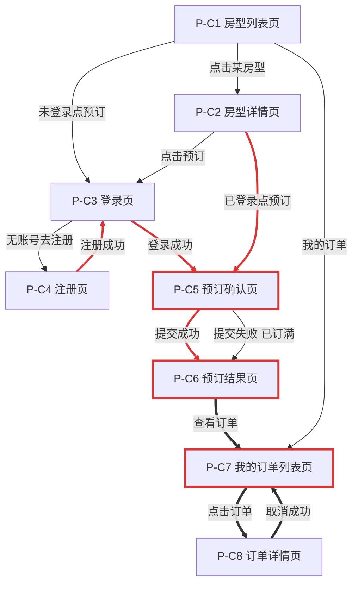
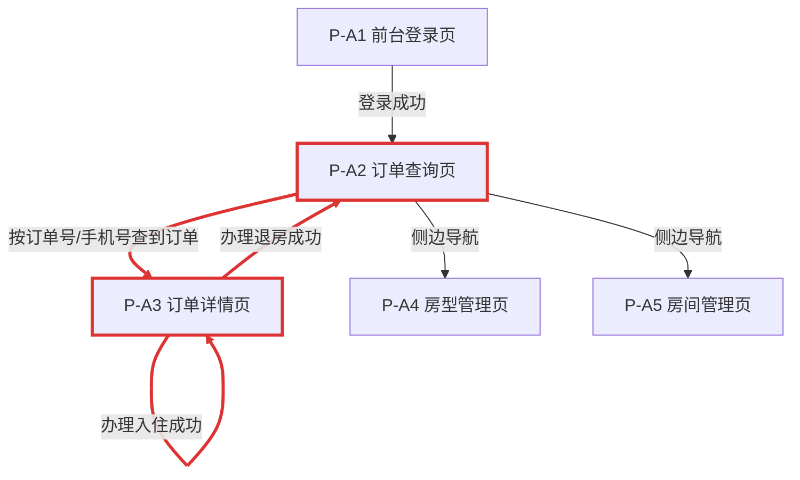

# 酒店预订系统 前端原型需求

| 项目 | 内容 |
| --- | --- |
| 文档版本 | v1.3 |
| 文档日期 | 2026-10-05 |
| 关联文档 | [01-需求文档.md](01-需求文档.md)（功能与规则以此为准） |
| 说明 | 仅低保真原型：页面结构、字段、交互与状态；不涉及视觉样式与技术选型 |
| 修订记录 | v1.3：补齐此前无出处的文案/字段——P-A1 空值提示"请输入账号/请输入密码"；P-A3"入住办理成功""退房办理成功""请选择房间"与字段"晚数"；P-A4/P-A5"保存成功" |

---

## 1. 页面清单

### 1.1 住客端（客户端）

| 编号 | 页面名称 | 用途 |
| --- | --- | --- |
| P-C1 | 房型列表页（首页） | 展示全部房型；选择入住/离店日期查询可订状态与剩余数量；预订入口 |
| P-C2 | 房型详情页 | 展示单房型详细介绍与单价；确认日期后进入预订 |
| P-C3 | 登录页 | 住客手机号+密码登录 |
| P-C4 | 注册页 | 新住客注册 |
| P-C5 | 预订确认页 | 填写住客姓名、手机号，确认日期与金额后提交订单 |
| P-C6 | 预订结果页 | 展示预订结果：成功则展示订单号，失败则展示原因（如已订满） |
| P-C7 | 我的订单列表页 | 展示本人全部订单及状态；进入详情或取消 |
| P-C8 | 订单详情页（住客） | 查看订单完整信息；未入住订单可取消 |

### 1.2 前台管理端

| 编号 | 页面名称 | 用途 |
| --- | --- | --- |
| P-A1 | 前台登录页 | admin 账号登录后台 |
| P-A2 | 订单查询页 | 按订单号/住客手机号查询订单；订单列表总览；办理入住的入口 |
| P-A3 | 订单详情页（前台） | 查看订单；对已确认订单办理入住（身份证登记+分配房间）；对已入住订单办理退房 |
| P-A4 | 房型管理页 | 房型列表；新增/修改房型（名称、单价、介绍） |
| P-A5 | 房间管理页 | 房间列表；新增/修改房间（房间号、所属房型） |

---

## 2. 页面流转

### 2.1 住客端

### 2.2 前台管理端

> 红色粗线为主链路：**预订（P-C5/C6）→ 查询（P-C7 / P-A2）→ 入住（P-A3）→ 退房（P-A3）**。
> 两端在"P-A3 订单详情"汇合：住客端产生的订单，由前台在此完成入住与退房。

---

## 3. 低保真线框（文字描述）

约定：每个页面描述【布局】【展示字段】【操作按钮】【空数据状态】【报错/异常状态】。

### 3.1 住客端

#### P-C1 房型列表页（首页）

- **布局**：顶部为导航栏（左：系统名"酒店预订系统"；右：登录/注册，已登录则显示"我的订单 + 手机号 + 退出"）；导航下方为日期选择区（入住日期、离店日期、"查询"按钮，默认入住=今天、离店=明天）；主体为房型卡片纵向列表
- **展示字段**（每个卡片）：房型名称、房型图片占位、单价（元/晚）、简介、查询日期区间内的剩余可订数量、可订状态标签（"可订"/"已订满"）
- **操作按钮**：卡片上"查看详情"、"立即预订"（已订满时置灰不可点）
- **空数据**：无房型时显示"暂无房型，敬请期待"
- **报错/异常**：未选日期点查询 → 提示"请选择入住和离店日期"；离店日期 ≤ 入住日期 → 提示"离店日期必须晚于入住日期"

#### P-C2 房型详情页

- **布局**：顶部导航同 P-C1；上部为图片占位区；中部为房型信息区；底部为固定操作条
- **展示字段**：房型名称、单价、详细介绍、当前所选入住/离店日期、晚数、小计金额（单价 × 晚数）
- **操作按钮**："修改日期"（回到日期选择）、"立即预订"
- **空数据**：不适用（由列表页跳转带入）
- **报错/异常**：无（房型无删除/下线功能，见 PRD v1.1）

#### P-C3 登录页

- **布局**：居中卡片表单
- **展示字段**：手机号输入框、密码输入框
- **操作按钮**："登录"、"去注册"链接
- **报错/异常**：手机号或密码为空 → 对应输入框下提示"请输入手机号/密码"；登录失败 → 顶部提示"手机号或密码错误"

#### P-C4 注册页

- **布局**：居中卡片表单
- **展示字段**：手机号、密码、确认密码
- **操作按钮**："注册"、"去登录"链接
- **报错/异常**：手机号格式不对 → "手机号格式不正确"；两次密码不一致 → "两次输入的密码不一致"；手机号已注册 → "该手机号已注册，请直接登录"

#### P-C5 预订确认页

- **布局**：上部为订单信息摘要区，中部为住客信息表单，底部为提交条
- **展示字段**：房型名称、入住/离店日期、晚数、单价、订单金额（合计）；表单：住客姓名、手机号；支付方式标注"到店支付"
- **操作按钮**："提交订单"、"返回修改"
- **报错/异常**：姓名为空 → "请输入住客姓名"；手机号格式不对 → "手机号格式不正确"；提交时库存被占满 → 跳转 P-C6 展示失败原因

#### P-C6 预订结果页

- **布局**：居中结果卡片
- **成功态**：成功图标占位、"预订成功"标题、订单号（突出展示，提示"入住时请出示订单号"）、订单摘要（房型/日期/金额）；按钮："查看我的订单"、"返回首页"
- **失败态**：失败图标占位、"预订失败"标题、原因文案（如"该房型所选日期已订满"）；按钮："重新选择房型"

#### P-C7 我的订单列表页

- **布局**：顶部导航同 P-C1；主体为订单卡片纵向列表（最新在前）
- **分页**：每页 10 条，底部翻页组件（页码 + 总数）
- **展示字段**（每条）：订单号、房型名称、入住/离店日期、金额、订单状态标签（已确认/已入住/已完成/已取消）
- **操作按钮**：每条订单"查看详情"
- **空数据**："您还没有订单，快去预订吧" + "去预订"按钮（跳 P-C1）
- **报错/异常**：未登录访问 → 跳转 P-C3 登录页

#### P-C8 订单详情页（住客）

- **布局**：上部状态标签区，中部订单信息区，底部操作区
- **展示字段**：订单号、状态、房型、入住/离店日期、晚数、住客姓名、手机号、金额、下单时间；已入住后追加：房间号
- **操作按钮**：状态=已确认时显示"取消订单"（点击后弹二次确认"确认取消该订单？"）；其余状态无操作按钮；"返回列表"
- **报错/异常**：取消失败（如状态已变化）→ 提示"订单状态已变更，请刷新查看"

### 3.2 前台管理端

#### P-A1 前台登录页

- **布局**：居中卡片表单，标题"酒店管理后台"
- **展示字段**：账号输入框、密码输入框
- **操作按钮**："登录"
- **报错/异常**：账号或密码错误 → "账号或密码错误"；账号/密码为空 → 表单内提示"请输入账号"/"请输入密码"

#### P-A2 订单查询页

- **布局**：左侧导航（订单查询 / 房型管理 / 房间管理）；右上显示"admin + 退出"；主体上部为查询区（输入框：订单号或手机号，"查询"按钮），下部为订单表格
- **展示字段**（表格列）：订单号、住客姓名、手机号、房型、入住日期、离店日期、金额、状态、下单时间
- **分页**：每页 10 条，表格下方翻页（页码 + 总数）
- **操作按钮**：每行"详情"（跳 P-A3）
- **空数据**：无订单或查询无结果 → 表格区域显示"暂无订单"
- **报错/异常**：查询条件为空点查询 → 默认展示全部订单（不做报错）

#### P-A3 订单详情页（前台）

- **布局**：上部订单信息区；中部"办理入住"操作区（仅状态=已确认时出现）；下部"办理退房"操作区（仅状态=已入住时出现）
- **展示字段**：订单号、状态、房型、晚数、入住/离店日期、住客姓名、手机号、金额、下单时间；已入住后追加：身份证号、房间号
- **办理入住操作区**：入住条件校验结果提示（通过/不通过及原因）、身份证号输入框、房间下拉选择（仅列该房型当前空闲房间）、"确认入住"按钮
- **办理退房操作区**："确认退房"按钮（点击弹二次确认）
- **操作反馈**：入住成功 → "入住办理成功"；退房成功 → "退房办理成功"；入住未选房间 → 表单内提示"请选择房间"
- **报错/异常**（入住校验，逐条提示原因）：
  - 状态非已确认 → "该订单当前状态不可办理入住"
  - 未到入住日 → "未到入住日期（入住日：X）"
  - 已超过入住窗口 → "已超过可入住时间（离店日：X），请引导客人取消重订"
  - 身份证格式不合法 → "身份证号格式不正确"
  - 无空闲房间 → "该房型当前无空闲房间"
- **报错/异常**（退房）：状态非已入住时操作区不展示；退房失败 → "订单状态已变更，请刷新"

#### P-A4 房型管理页

- **布局**：左侧导航同 P-A2；主体上部"新增房型"按钮，下部房型表格
- **展示字段**（表格列）：房型名称、单价、介绍（截断显示）、房间数
- **操作按钮**：每行"编辑"；新增/编辑弹窗表单：房型名称、单价、介绍，"保存"/"取消"
- **空数据**："暂无房型，请点击新增"
- **操作反馈**：保存成功 → "保存成功"
- **报错/异常**：名称/单价为空或单价非正数 → 表单内提示"请填写完整的房型信息"

#### P-A5 房间管理页

- **布局**：左侧导航同 P-A2；主体上部"新增房间"按钮，下部房间表格（可按房型筛选）
- **展示字段**（表格列）：房间号、所属房型、当前状态（空闲/入住中）
- **操作按钮**：每行"编辑"；新增/编辑弹窗表单：房间号、所属房型下拉，"保存"/"取消"
- **空数据**："暂无房间，请点击新增"
- **操作反馈**：保存成功 → "保存成功"
- **报错/异常**：房间号为空或重复 → "房间号不能为空且不可重复"；在住房间改挂其他房型 → "该房间正在入住中，不可调整"

---

## 4. 与 PRD 的对应关系

| 原型内容 | 对应 PRD |
| --- | --- |
| P-C1~C8、P-A1~A3 | 功能清单 P0 项、UC-01~08 |
| P-A4、P-A5 | 功能清单 P1 项、UC-09 |
| 入住校验的 5 条报错提示 | BR-06 四条校验 + 无空闲房间 |
| 取消二次确认、终态无操作入口 | BR-04、订单状态流转表 |
| 预订结果页突出订单号 | BR-08（入住凭订单号） |
